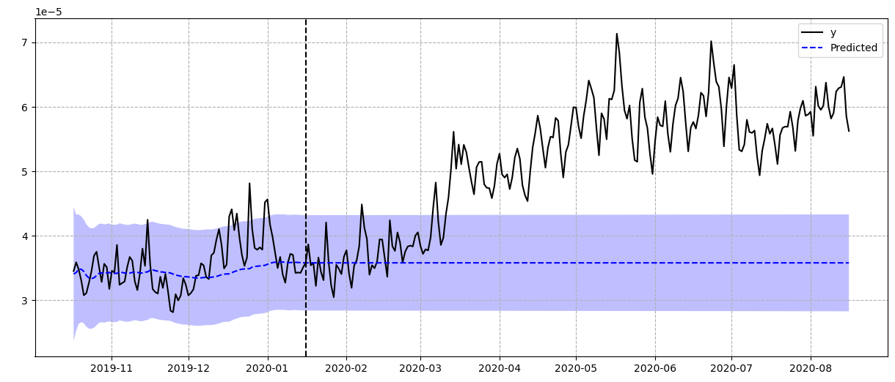
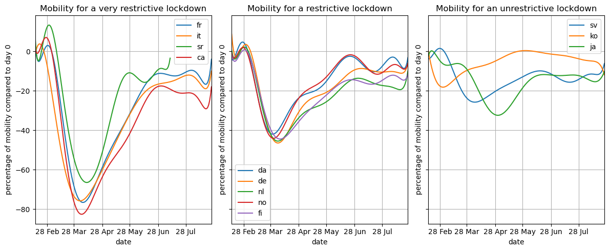
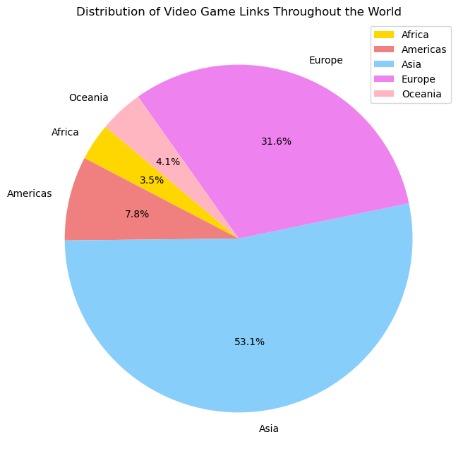

# How Lockdown Affected Attention Towards Video Games

## Abstract:

During the COVID-19 lockdown, people had to find other ways to keep themselves occupied, creating a rise in video game popularity. This project aims to analyze the correlation between the severity of the lockdown with the rise and fall of various video game genres. This will be done by analyzing the language used in different Wikipedia pages for each game, as well as examining the mobility data in each country to estimate the severity of lockdown.

Our project tells a fascinating story about how different types of video games faced tough challenges. We looked at the language of Wikipedia pages and connected them with data about that country's mobility change during the pandemic (for the languages that are mainly spoken in only one country). This helps us see interesting trends. Furthermore, English Wikipedia can show us what's happening worldwide as it is the most used worldwide language. Our story shows how strict lockdowns relate to what video game genres people tend to play more of. This is useful information about how the video game industry is changing during global disruptions and if it had a lasting effect on various genres' popularity. This can be useful information for game developers when choosing what game genre to choose, and what target audience to make it for.

### Research Questions:
- Is there a consistent trend for the same genres of video games during the COVID-19 pandemic?
  - Investigate whether certain video game genres experienced similar patterns of rise in popularity or decline during the pandemic.
  - Explore potential factors influencing these trends, such as changes in user preferences, gaming habits, or social dynamics.

- What is the relationship between mobility patterns and the traffic of video game Wikipedia pages?
  - Examine how variations in mobility data, reflecting the severity of lockdown measures, correspond to changes in the viewership of video game Wikipedia pages.
  - Analyze whether increased or decreased mobility aligns with heightened interest in specific video game genres, indicating a potential connection between real-world restrictions and virtual entertainment.

- To what extent can English Wikipedia pages serve as a reliable estimate of the average video game popularity?
  - Assess the generalizability of findings from English Wikipedia pages to global trends, considering cultural and linguistic differences.
  - Explore whether language-specific Wikipedia pages provide consistent insights into the popularity or decline of video game genres, or if there are notable variations that need to be considered in the analysis.

- How did the popularity change in board games compare to online games during COVID-19?
  - Is there a trend between countries that tend to have larger families with the popularity of board games in that country (Ones that have rules that can be looked up on Wikipedia).

## Additional Datasets and Methods:

To enrich our understanding, we have included additional datasets. These supplementary data sources are instrumental in examining the interesting relationship between external factors, such as the global pandemic, and the interest in different video game genres. These include all the frequencies at which Wikipedia pages for each video game in every language was accessed, especially during the COVID-19 pandemic. After having done some preprocessing and inital analysis on the dataset, we found that most of the data is useful and interesting. Although there were some missing values that we found in the dataset for certain wikipedia pages. This is all shown in the notebook. Some interesting findings that have already been done are:

- Not only did the use of wikipedia rise, but video game related pages rose more (here is the minecraft data for example):

We can see that the predicted frequency at which the minecraft wikipedia would be accessed was exceeded (the frequency is calculated as a percentage compared to the usage of wikipedia)

- The countries showed different trends with regard to their mobilities, which can be split into three categories as shown below:

This shows that we can easily group countries by their COVID-19 lockdown restrictiveness in order to analyse if they show consistent trends with regard to each video game genre's popularity shift.

- Furthermore another interesting idea that could be useful to explain one game's popularity change compared to another is what region the game is based on in the world:

This shows which continents had a video game based on them, but we can dive deeper, such as (Northern, Eastern, Southern, and Western Europe).

We will extend our analysis to more games and more languages, we will study different types of games (solo player, multiplayer, offline, online, campaign, battle royale, etc...) and find the ones with the highest growth of interest. To do this we will create a dataframe that will link each game to different topics (similar to the topics_linked.csv that is part of the coronawiki dataset).

All this already shows that there are very promising trends between the pandemic and video games, further analysis is needed, as detailed by these milestones:

### Internal milestones:
- Done for 19/11:
  - Adressing the missing values that some countries have for their wikipedia traffic.
  - Choosing which video games are a good choice to represent a genre.
  - Choosing what languages are good due to them being mostly spoken in only one country.
- Done for 01/12:
  - Finding trends for each genre during the pandemic using the english wikipedia as it's an "average" since most countries speak at least some english.
  - Finding trends between the mobility dataset and each video game genre.
- Done for 08/12:
  - Finish answering all research questions
- Done for 15/12:
  - Cleaning and commenting the code.
  - Creating the story with the findings.
- Done for 22/12: 
  - Creating the website for the datastory.

| Student | Task |
| -------- | -------- |
| Kyan Achtari | Creating the data story. Choosing representative video games and languages. Answering Question 3.1 & 3.2 |
| Mehdi Abdallahi | Creating the data story. Finding trends. Answering Questions 1.1 & 1.2 |
| Corentin Plumet | Creating the data story. Adressing the missing values. Answering Question 2.1 |
| Zhuofu Zhou | Creating the website. Cleaning and commenting the code. Answering Question 2.2|
| Yichen Liu | Creating the webstie. Cleaning and commenting the code. Answering Question 4.1 |
